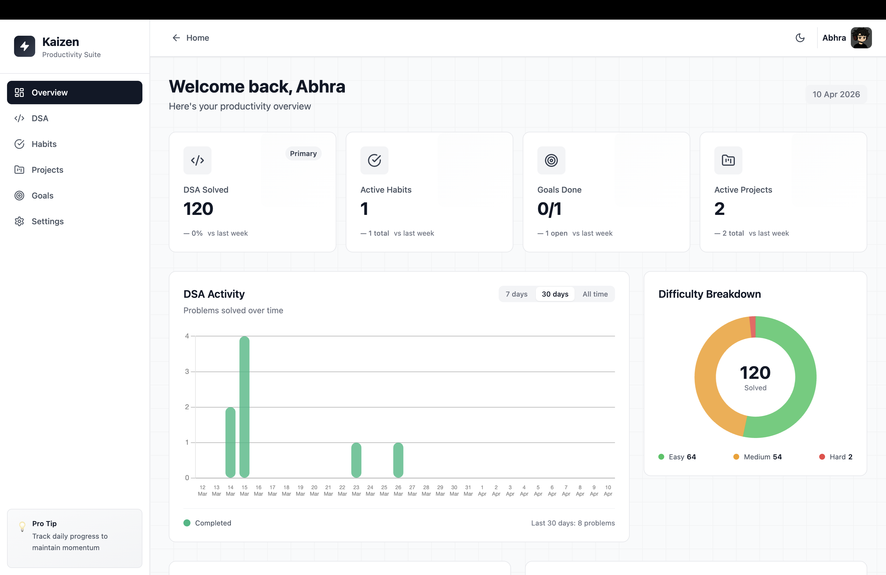

<div align="center">

# Kaizen

**Improve 1% today. Repeat tomorrow.**

A productivity and continuous improvement tracker for habits, DSA problems, projects, and goals — built with React, TypeScript, and Supabase.

[](https://kaizen-phi-five.vercel.app)
[](https://react.dev)
[](https://www.typescriptlang.org)
[](https://supabase.com)
[](https://tailwindcss.com)

<br />



</div>

---

## Table of Contents

- [Features](#features)
- [Tech Stack](#tech-stack)
- [Architecture](#architecture)
- [Getting Started](#getting-started)
- [Project Structure](#project-structure)
- [Database Schema](#database-schema)
- [Dark Mode](#dark-mode)
- [Deployment](#deployment)
- [Roadmap](#roadmap)

---

## Features

### DSA Problem Tracker
- Log problems by **difficulty** (Easy / Medium / Hard) and **topic**
- Track solve rates with bar charts and doughnut breakdowns
- **LeetCode auto-sync** — connects to your LeetCode account and imports solved problems automatically via Supabase Edge Functions and `pg_cron`
- Topic heatmap and recent activity timeline

### Habit Tracker
- Create daily or weekly habits
- One-tap check-in to build streaks
- Horizontal streak visualizations sorted by consistency

### Project Manager
- Track projects from **Planning → In Progress → Review → Done**
- Progress bars, team members, and tech-stack tags
- GitHub repo and live demo links on every project card

### Goal Setter
- Define goals with deadlines, categories, and progress percentages
- Color-coded progress bars (green / amber / red)
- Mark goals complete when shipped

### Dashboard Overview
- Unified dashboard with real-time metric cards
- DSA activity bar chart with **7d / 30d / All** time range toggle
- Difficulty breakdown doughnut chart
- Habit streaks, goal progress, project status, topic heatmap, and recent activity — all in one view

### General
- **Dark mode** — monochromatic palette, class-based toggle, persisted in `localStorage`
- **OAuth + email/password** authentication via Supabase Auth
- **Row Level Security** — every query is scoped to the authenticated user
- Fully responsive across mobile, tablet, and desktop
- Production landing page with animated hero, feature showcase, and tech marquee

---

## Tech Stack

| Layer | Technology |
|-------|-----------|
| **Framework** | React 18 |
| **Language** | TypeScript (strict mode) |
| **Build Tool** | Vite 5 |
| **Styling** | TailwindCSS 3.4 with custom dark theme tokens |
| **Database** | Supabase (PostgreSQL) with Row Level Security |
| **Auth** | Supabase Auth (email/password + OAuth) |
| **Charts** | Chart.js 4 via react-chartjs-2 |
| **Routing** | React Router DOM v6 (BrowserRouter) |
| **Icons** | lucide-react |
| **Deployment** | Vercel |

---

## Architecture

```
StrictMode
  └─ ThemeProvider
       └─ BrowserRouter
            └─ AuthProvider
                 └─ ErrorBoundary
                      └─ App
                           ├─ Public Routes  → /  /login  /signup
                           └─ Protected Routes (Sidebar + Navbar shell)
                                → /dashboard  /dsa  /habits  /projects  /goals  /settings
```

**Key design decisions:**

- **No global state library** — each page fetches its own data directly from Supabase. Auth state is shared via `AuthContext`.
- **Supabase as the entire backend** — no separate API server. Auth, database, edge functions, and cron jobs all live in Supabase.
- **OAuth callback handling** — Supabase returns tokens as URL fragments (`#access_token=...`). `App.tsx` detects auth redirect params and renders `AuthCallback` to parse them.
- **SPA routing on Vercel** — `vercel.json` rewrites all paths to `index.html`.

---

## Getting Started

### Prerequisites

- **Node.js** 18+
- **npm** 9+
- A [Supabase](https://supabase.com) project (free tier works)

### 1. Clone the repository

```bash
git clone https://github.com/Abhra0404/Kaizen.git
cd Kaizen
```

### 2. Install dependencies

```bash
npm install
```

### 3. Configure environment variables

```bash
cp .env.example .env
```

Edit `.env` and add your Supabase credentials:

```env
VITE_SUPABASE_URL=https://your-project-id.supabase.co
VITE_SUPABASE_ANON_KEY=your-anon-public-key-here
```

### 4. Set up the database

Run the schema in your Supabase SQL Editor:

```bash
# Copy the contents of supabase/schema.sql and execute in
# Supabase Dashboard → SQL Editor → New Query → Run
```

This creates all tables (`habits`, `projects`, `dsa_problems`, `goals`, `user_profiles`, `leetcode_problem_cache`) with Row Level Security policies.

### 5. Start the development server

```bash
npm run dev
```

The app will be available at `http://localhost:5173`.


---

## Project Structure

```
src/
├── components/
│   ├── dashboard/          # Dashboard widgets
│   │   ├── ChartCard.tsx          # Bar chart with time range toggle
│   │   ├── DifficultyBreakdown.tsx # Doughnut chart (Easy/Medium/Hard)
│   │   ├── GoalsProgress.tsx       # Goal progress list
│   │   ├── HabitStreaks.tsx         # Horizontal streak bars
│   │   ├── MetricCard.tsx          # Single metric display
│   │   ├── ProjectsList.tsx        # Project status cards
│   │   ├── RecentActivity.tsx      # Timeline of recent solves
│   │   └── TopicHeatmap.tsx        # Topic frequency bars
│   ├── layout/             # App shell
│   │   ├── AppLayout.tsx
│   │   ├── AuthLayout.tsx
│   │   ├── Navbar.tsx
│   │   └── Sidebar.tsx
│   └── ui/                 # Reusable primitives
│       ├── EmptyState.tsx
│       ├── ErrorBanner.tsx
│       ├── Modal.tsx
│       ├── PageHeader.tsx
│       ├── Spinner.tsx
│       └── StatCard.tsx
├── constants/              # App-wide constants & Supabase config
├── contexts/
│   ├── AuthContext.tsx      # Auth state (user, session, signIn/Out)
│   └── ThemeContext.tsx     # Dark mode toggle & persistence
├── hooks/                  # Custom React hooks
├── lib/
│   └── supabase.ts         # Supabase client initialization
├── pages/
│   ├── Landing.tsx          # Marketing page
│   ├── Login.tsx            # Login form
│   ├── Signup.tsx           # Registration form
│   ├── AuthCallback.tsx     # OAuth token handler
│   ├── Overview.tsx         # Dashboard
│   ├── DSA.tsx              # DSA problem tracker
│   ├── Habits.tsx           # Habit tracker
│   ├── Projects.tsx         # Project manager
│   ├── Goals.tsx            # Goal tracker
│   └── Settings.tsx         # User settings
├── services/               # API service layers
├── types/                  # TypeScript type definitions
├── App.tsx                 # Route definitions & auth guard
├── main.tsx                # Entry point & provider tree
└── index.css               # Global styles & animations
```

---


### LeetCode Integration

Kaizen supports **automatic LeetCode sync** via:
- **Supabase Edge Functions** (`leetcode-sync`, `leetcode-batch-sync`) — fetch solved problems from LeetCode's API
- **`pg_cron`** — runs sync every 10 minutes and cleans up stale logs daily
- **`user_profiles`** table — stores LeetCode session cookies and sync metadata

---

<div align="center">

**Built with focus. Designed for growth.**

[Live Demo](https://kaizen-phi-five.vercel.app) · [Report Bug](https://github.com/Abhra0404/Kaizen/issues) · [Request Feature](https://github.com/Abhra0404/Kaizen/issues)

</div>
